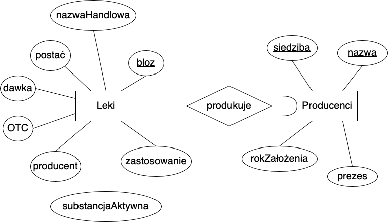

# Substancje lecznicze - baza danych

## Streszczenie

Skrypt instalacyjny tutułowej bazy. Jest to projekt końcowy z przedmiotu *Bazy danych*. Ściślej, jego tłumaczenie do *Pythona*, bo oryginał został napisany z myślą o TSQL.

## Spis spraw
1. [Instalacja bazy](#instalacja-bazy)
2. [Model E/R](#model-er)
3. [Model relacyjny](#model-relacyjny)
4. [Co dalej?](#co-dalej)
5. [Literatura](#literatura)

## Instalacja bazy
W celu powołania bazy do życia należy:
1. zainstalować ten pakiet;
2. zaimportować moduł `substances.database` w środowisku lub w powłoce Pythona;
3. wywołać funkcję `initialize`, np. `substances.database.initialize()`.

Następnie, w bieżącym katalogu pojawi się plik `substances.db`. Zapytania do bazy można wykonać z użyciem pakietu [sqlite3](https://docs.python.org/3/library/sqlite3.html) (swoją drogą ninejszy pakiet opiera się na tym linkowanym).

## Model E/R

Analiza została przeprowadzona z użyciem [[1]](#widom).

1. Atrybuty zbioru encji *Leki*
+ <u>bloz</u> - unikatowy kod nadawany każdej substancji leczniczej
+ <u>nazwaHandlowa</u>
+ <u>substancjaAktywna</u>
+ <u>postać</u> - postać leku (np. tabletki, syrop, itp.)
+ <u>dawka</u> - ilość substancji aktywnej w jednostce leku
+ OTC - lek wydawany bez recepty (*over the counter*)
+ zastosowanie
+ producent

2. Atrybuty zbioru encji *Producenci*
+ <u>nazwa</u>
+ <u>siedziba</u>
+ prezes
+ rokZałożenia

Atrybuty podkreślone stanowią elementy klucza lub kluczy.

<figure>
    
    <figcaption>Rys. 1 Diagram związków encji dla bazy danych substancji leczniczych wykonany przy pomocy <a href="draw.io">draw.io</a></figcaption>
</figure>

Na rysunku 1 są przedstawione dwa zbiory encji **Leki** oraz **Producenci** połączone związkiem binarnym **produkuje** typu *wiele-do-jeden*. Strzałka z zaokrąglonym grotem skierowana w stronę zbioru **Producenci** oznacza, że dla ustalonej encji ze zbioru **Leki** istnieje dokładnie jedna encja ze zbioru **Producenci**.

## Model relacyjny

Związek **produkuje** z modelu E/R jest *wiele-do-jeden* z **Leków** do **Producentów**, więc oba zbiory encji zostaną połączone w jedną relację, nazwijmy ją $R$, o schemacie:
$$
    R(\mathrm{bloz,\ nazwaHandlowa,\ substancjaAktywna,\ postać,\ dawka,\ OTC,} \\[1ex] \mathrm{zastosowanie,\ producent,\ siedziba,\ prezes,\ rokZałożenia}).
$$

Wprowadźmy następujące oznaczenia:
$$
    A \mapsto \mathrm{bloz}, \quad B \mapsto \mathrm{nazwaHandlowa}, \quad C \mapsto \mathrm{substancjaAktywna}, \\[2ex] D \mapsto \mathrm{postać}, \quad E \mapsto \mathrm{dawka}, \quad F \mapsto \mathrm{OTC}, \quad G \mapsto \mathrm{zastosowanie}, \\[2ex] H \mapsto \mathrm{producent}, \quad X \mapsto \mathrm{siedziba}, \quad Y \mapsto \mathrm{prezes}, \quad Z \mapsto \mathrm{rokZałożenia}.
$$

Zachodzą następujące zależności funkcyjne:
$$
    A \to BC\dots H, \quad B \to AC\dots H, \quad CDE \to ABFGH, \quad HX \to YZ.
$$

Zauważmy, że w relacji $R$ nie istnieją klucze jednoelementowe, ale
$$
    \{A, X\}^+ = \{A, B, C, D, E, F, G, H, X, Y, Z\},
$$
czyli zbiór $\{A, X\}$ tworzy klucz. Ponadto
$$
    \{H, X\}^+ = \{H, X, Y, Z\},
$$
co oznacza, że $\{H, X\}$ nie jest nadkluczem i w konsekwencji zależność funkcyjna $HX \to YZ$ narusza warunek BCNF. Relację $R$ rozbijamy na dwie relacje $R'$ oraz $R''$ o schematach:
$$
    R'(A, B, C, D, E, F, G, H, X), \\[2ex]
    R''(H, X, Y, Z).
$$
Relacja $R''$ jest w BCNF, a jej kluczem jest $\{H, X\}$.
Dla relacji $R'$ zbiór $\{A\}$ nie tworzy nadklucza, czyli zależność $A \to BC\dots H$ narusza warunek BCNF. W konsekwencji rozbijamy $R'$ na dwie relacje o schematach:
$$
    R'''(A, \dots, H), \quad R^{IV}(A, X).
$$
Relacja $R^{IV}$ jest dwuargumentowa i w konsekwencji w BCNF. Nie dziedziczy ona żadnych zależności funkcyjnych, więc kluczem jest $\{A, X\}$.

Zależności funkcyjne, które zachodzą w $R'''$ to: $A \to BC\dots H$, $B \to AC\dots H$, $CDE \to ABFGH$. Widać, że kluczami są: $\{A\}$, $\{B\}$, $\{C, D, E\}$ i $R'''$ jest w BCNF.

|  Relacja |                        Atrybuty                       |                        Zależności funkcyjne                       |                 Klucz(e)                 | Czy w BCNF? |
| -------- | ----------------------------------------------------- | ----------------------------------------------------------------- | ---------------------------------------- | ----------- |
|    $R$   | $A,$ $B,$ $C,$ $D,$ $E,$ $F,$ $G,$ $H,$ $X,$ $Y,$ $Z$ | $A \to B\dots H,$ $B \to AC\dots H,$ $CDE \to ABFGH,$ $HX \to YZ$ | $\{A, X\},$ $\{B, X\},$ $\{C, D, E, X\}$ |     Nie     |
|   $R'$   |      $A,$ $B,$ $C,$ $D,$ $E,$ $F,$ $G,$ $H,$ $X$      |                                                                   |                                          |     Nie     |
|   $R''$  |                   $H,$ $X,$ $Y,$ $Z$                  |                            $HX \to YZ$                            |                $\{H, X\}$                |     Tak     |
|  $R'''$  |         $A,$ $B,$ $C,$ $D,$ $E,$ $F,$ $G,$ $H$        |        $A \to B\dots H,$ $B \to AC\dots H,$ $CDE \to ABFGH$       |      $\{A\},$ $\{B\},$ $\{C, D, E\}$     |     Tak     |
| $R^{IV}$ |                        $A,$ $X$                       |                                Brak                               |                $\{A, X\}$                |     Tak     |

## Co dalej?

+ Utworzenie funkcjonalności do instalowania bazy z poziomu terminala.

## Literatura
<a name="widom">[1]</a> H. Garcia-Molina, J.D. Ullman, J. Widom, *Systemy baz danych. Pełny wykład*, WNT, Warszawa, 2006.